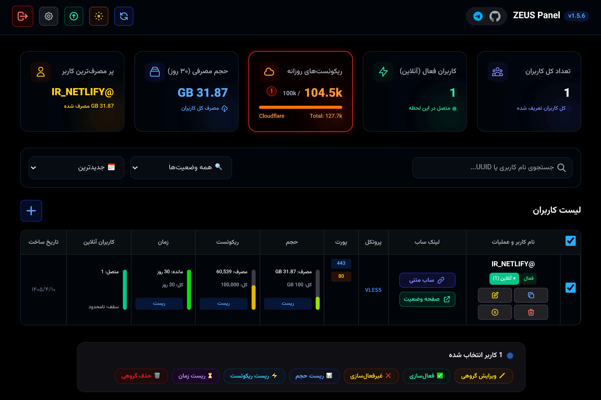
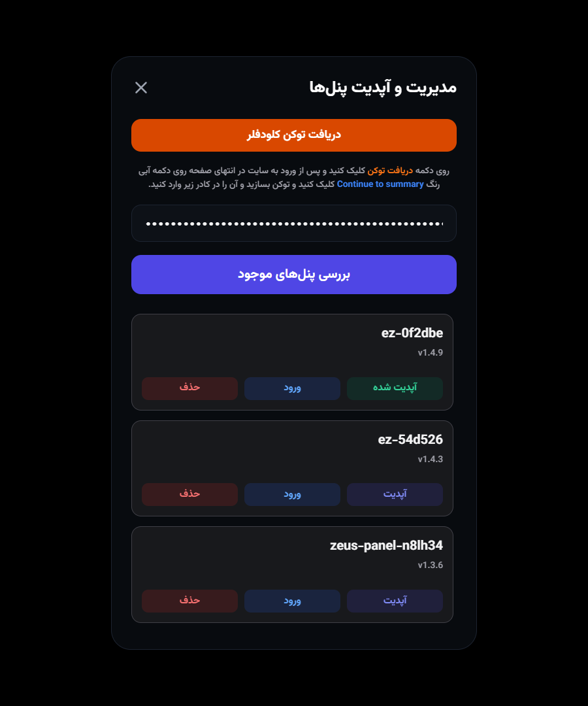
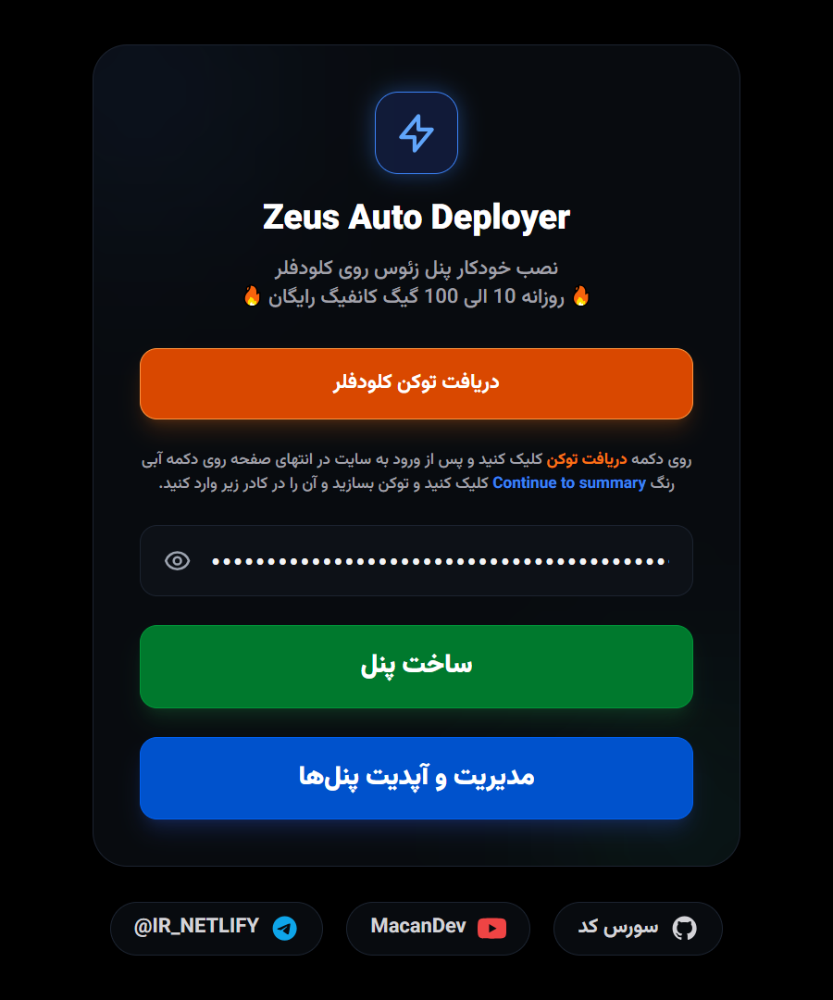
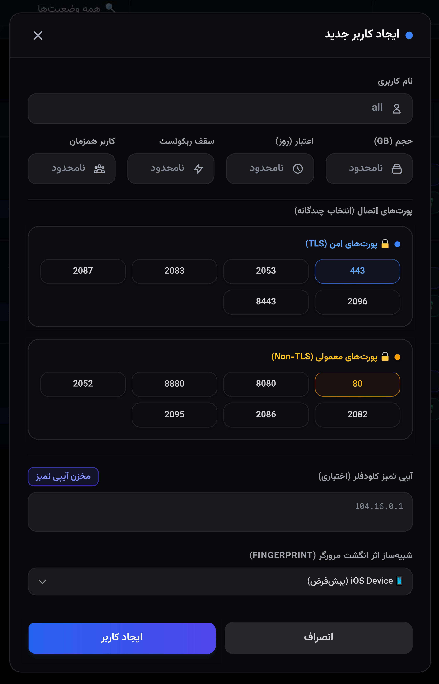
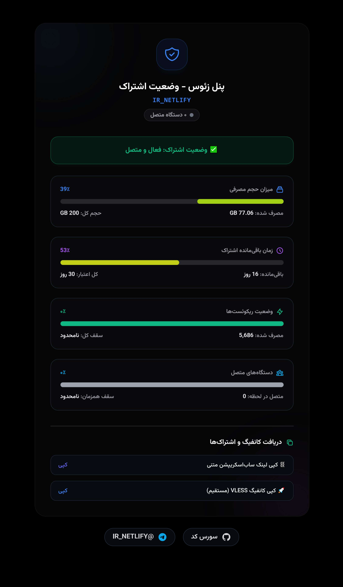

<p align="center">
  
</p>

<table width="100%">
  <tr>
    <td width="50%" valign="middle" align="center"></td>
    <td width="50%" valign="middle" align="center"></td>
  </tr>
  <tr>
    <td width="50%" valign="middle" align="center"></td>
    <td width="50%" valign="middle" align="center"></td>
  </tr>
</table>

<div align="center">
  <h1>⚡ Atlas for Cloudflare Workers</h1>
  <p>
    
    
    
  </p>
</div>

---

## معرفی

این ریپو برای دیپلوی خودکار **Atlas** روی Cloudflare Workers آماده شده است. فایل‌های اصلی پروژه با نام `atlas` ساخته شده‌اند و فایل فعلی Worker در `atlaspanel.js` قرار دارد.

منبع آپدیت Clean IP دقیقاً طبق درخواست، فقط از این مسیر خوانده می‌شود:

```txt
https://github.com/IR-NETLIFY/zeus/blob/main/ips.txt
```

## فایل‌های مهم

| فایل | کاربرد |
|---|---|
| `atlaspanel.js` | Worker اصلی پنل |
| `atlaspanel-deployer.js` | Deployer اختیاری برای ساخت Worker و D1 از طریق توکن Cloudflare |
| `wrangler.toml` | تنظیمات Cloudflare Worker برای دیپلوی Git/CLI |
| `package.json` | اسکریپت‌های ساده برای deploy/dev/check |
| `photos/atlas-*.png` | تصاویر مستندات با نام Atlas |

## تنظیمات Cloudflare

برای اجرای پنل، Worker باید یک D1 binding با نام دقیق `DB` داشته باشد. اگر دیپلوی از قبل روی Cloudflare تنظیم شده، فقط مطمئن شوید Binding با همین نام وجود دارد.

اگر با Wrangler دیپلوی می‌کنید، در `wrangler.toml` بخش D1 را بعد از ساخت دیتابیس فعال کنید و مقدار `database_id` را قرار دهید.

## دیپلوی

```bash
npm install
npm run deploy
```

یا اگر Cloudflare به GitHub وصل است، کافی است محتوای این پروژه را در شاخه `main` ریپوی زیر قرار دهید و Push کنید:

```txt
https://github.com/leonardo0231/Setad
```


## اصلاح رفتار IP و مسیر پنل

در این نسخه اگر آدرس اصلی Worker را بدون مسیر باز کنید، مستقیم به `/panel` منتقل می‌شوید. همچنین دریافت Clean IP از داخل خود Worker و مسیر `/api/clean-ips` انجام می‌شود. منبع پنل فقط لینک `https://github.com/IR-NETLIFY/zeus/blob/main/ips.txt` است؛ Worker همین لینک blob را به raw تبدیل می‌کند تا به‌جای HTML صفحه GitHub، فقط متن واقعی `ips.txt` خوانده شود.

## مسیرهای اصلی

- پنل: `/panel`
- لاگین: `/login`
- وضعیت کاربر: `/status/<username>`
- Subscription: `/sub/<username>` و `/feed/<username>`

## نکته مهم درباره آپدیت

آپدیت سورس پنل از ریپوی خودتان انجام می‌شود:

```txt
https://raw.githubusercontent.com/leonardo0231/Setad/refs/heads/main/atlaspanel.js
```

اما آپدیت IPها فقط از لینک blob مشخص‌شده‌ی IR-NETLIFY انجام می‌شود و هیچ فایل/مسیر دیگری برای IPها استفاده نمی‌شود.

## نکته مهم درباره IPها

در این نسخه منبع IP فقط این لینک است:

```txt
https://github.com/IR-NETLIFY/zeus/blob/main/ips.txt
```

Worker این لینک نمایشی GitHub را فقط داخل سرور به raw تبدیل می‌کند تا HTML صفحه GitHub وارد IPها نشود. اگر قبلاً HTML داخل دیتابیس ذخیره شده باشد، Worker در اولین اجرا آن را از فیلد IP کاربران پاک‌سازی می‌کند. همچنین endpoint زیر برای پاک‌سازی دستی وجود دارد:

```txt
POST /api/clean-stored-ips
```

## آخرین تغییرات نسخه 1.5.12

- دریافت IPها فقط از `https://github.com/IR-NETLIFY/zeus/blob/main/ips.txt` انجام می‌شود.
- داده خام از `raw.githubusercontent.com` خوانده می‌شود و فقط IP/hostname معتبر وارد پنل می‌شود.
- یک cache روزانه اضافه شد: روزی یک بار GitHub چک می‌شود؛ اگر IPها تغییر کرده باشند cache آپدیت می‌شود، و اگر تغییری نباشد یا خطا رخ دهد از آخرین لیست سالم استفاده می‌شود.
- پاپ‌آپ پیام همگانی/هشدار فروش از پنل حذف شد.
